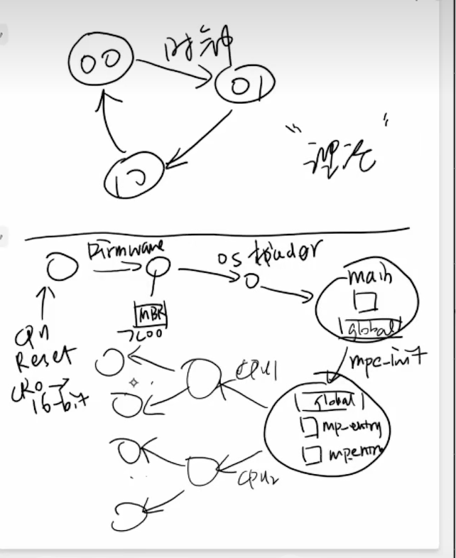

# 操作系统的状态机模型

## CPU reset(初始状态)

- CPU reset之后，处理器处于初始状态
  - PC一般指向一段memory-mapped ROM，ROM存储了厂商提供的固件
  - 缓存、虚拟存储等处于关闭状态
- 固件(firmware)：将用户数据加载到内存/操作系统

## 固件：BIOS &UEFI

### Legacy BIOS

CPU会扫描磁盘寻找可加载操作系统盘

主引导扇区：MBR

BIOS和操作系统启动器之间的约定：

- MBR(前512B)从磁盘搬到内存
- PC调至MBR开头

- 执行程序以加载更多内容

存在的问题：ROM可能会被改写从而无法启动系统

### UEFI

## 操作系统的状态机模型

Firmware 和 boot loader 共同完成 “操作系统的加载”

- 初始化全局变量和栈；分配堆区 (`heap`)
- 为`main`函数传递参数
  - 谁给操作系统传递了参数？
  - 如何实现参数传递？

进入 C 代码之后

- 完全遵循 C 语言的形式语义
- 但有一些行为 “补充” —— AbstractMachine API

### AbstractMachine 对 “C 程序语义” 做出的扩充

TRM + MPE

- 完全等同于多线程 (处理器相当于线程) - L1/native
- IOE API: 完全是普通的库函数
  - 同一设备的数据竞争 = undefined behavior

CTE

- 允许创建多个执行流 (类比协程) - M2
- yield 主动切换；会被中断被动打断
- `on_interrupt` 会拦截到中断事件

VME

- 允许创建一个 “经过地址翻译的执行模式”
- 通过 CTE API 管理

​	

## 总结

- CPU Reset → Firmware → Boot loader → Kernel `_start()`