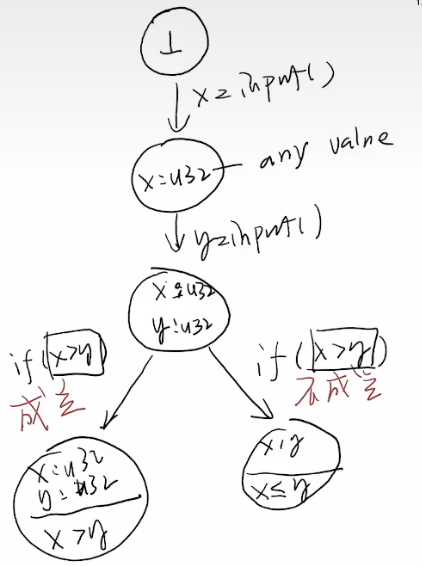
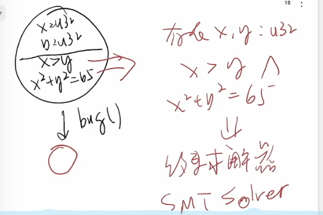

# 状态机模型的应用

### 超标量(superscalar)/乱序执行处理器

- 允许在状态机上“跳跃”
- IPC(instructions per clock)>1

## Trace调试器

程序执行=状态机执行

可以观察、改变状态机执行过程

### 时间旅行式的调试

- 记录所有的s<sub>i</sub>，就能实现任意的时间旅行

问题：开销太大

- 方法：只记录初始状态以及每条指令前后状态的不同之处
  - 正向执行：s<sub>i+1</sub>=s<sub>i</sub>+Δ<sub>0</sub>
  - 反向执行：s<sub>i-1</sub>=s<sub>i</sub> e Δ<sub>0</sub><sup>-1</sup>
- `gdb`功能
  - record full:开始记录
  - record stop:结束记录
  - `reverse-step`/`reverse-stepi`:时间旅行调试(`rsi`)

### 记录和重放

- 确定的程序不需要任何记录，从开始状态推下去就可以了(无随机数单线程)

- 非确定的程序：记录指令数、结果、非确定指令、上锁顺序即可（快照）
  - 工具：`rr`(Mozilla) 

## 采样状态机执行

### Profiler和性能摘要

隔一段时间“暂停”程序，观察状态机的执行

- perf list,perf stat,perf record,perf report

主要的性能瓶颈：小内存分配时的锁拥堵

- 解决方法：profiler

## Model Checker

可以压缩状态空间而不必暴力遍历

例：

```c
u32 x = rdrand();
u32 y = rdrand();
if (x > y)
  if (x * x + y * y == 65)
    bug();
...
assert(ptr); // 可能空指针吗？

```

更高效的 Model Checker: “将相似状态合并”

暴力遍历：2^64种情况

措施：有分支时才分裂状态





