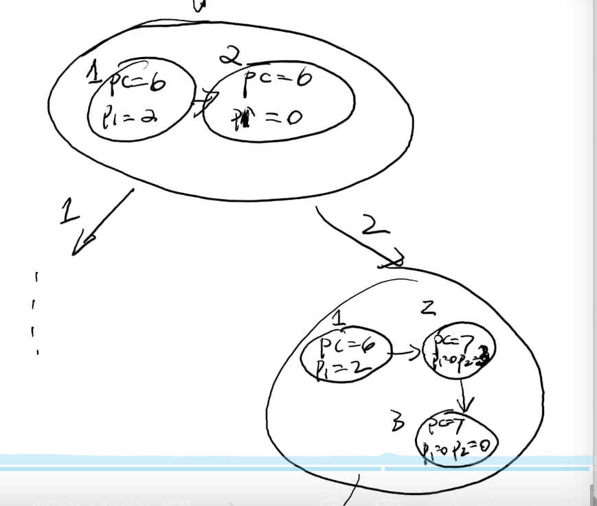

# 操作系统上的进程

## 系统调用(`Syscall`)

- 进程管理
- 内存管理
- 文件管理

## Fork：复制状态机

返回类型：`int`

- 立即复制状态机(完整内存)
- 新创建进程返回0
- 执行fork的进程返回子进程的进程号

示例：

代码

```c
#include <unistd.h>
#include <stdio.h>

int main()
{
    pid_t pid1 = fork();
    pid_t pid2 = fork();
    pid_t pid3 = fork();
    printf("Helllo World from (%d, %d, %d)\n", pid1, pid2, pid3);
}
```

求输出内容。




### 神奇的`printf`

```c
#include <stdio.h>
#include <unistd.h>
#include <sys/wait.h>

int main(int argc, char * argv[])
{
    for(int i = 0; i < 2; i++)
    {
        fork();
        printf("Hello\n");
    }
    for(int i = 0; i < 2; i++)
    {
        wait(NULL);
    }
}
```

- 执行`./a.out`，结果为6行
- 将其输出至管道`./a.out | cat`，结果为8行

根本原因：

- 标准输出至终端(屏幕)时为line buffer，即碰到\n就会清空缓冲区输出
- 输出至管道 or 文件时为full buffer，到了指定大小才会清空缓冲区输出
- fork()执行会将库函数的状态复制一份，包括当时的缓冲区

6行的原因：fork俩进程--两次一个hello进缓冲区--缓冲区清空输出--fork四个进程--四次一个hello至缓冲区--缓冲区清空输出

8行的原因：fork俩进程--两次一个hello进缓冲区--fork四个进程，缓冲区有一个hello--四次的缓冲区加一个hello--缓冲区清空输出

解决方法：`setbuf(stdout, NULL)`将缓冲区设为空，`printf`啥输出啥，这样就会完全一致了

## `Execve()`：重置状态机

作用：将当前运行的状态机重置成另一个程序的初始状态

`pid` == 0时调用

```
int execve(const char *filename, char * const argv, char * const envp);
```

- 执行名为 `filename` 的程序
- 允许对新状态机设置参数`argv(v)`和环境变量`envp(e)`
  - 刚好对应了 `main()` 的参数！
  - [`execve demo.c`](http://jyywiki.cn/pages/OS/2022/demos/execve-demo.c)

## _exit()：销毁状态机

子进程终止会通知父进程

## 总结

- 对 “操作系统” 的完整理解
  - CPU Reset → Firmware → Loader → Kernel `_start()` → 执行第一个程序 `/bin/init` → 中断/异常处理程序
  - 一个最小的 Linux 系统的例子
- 进程管理 API
  - fork, `execve`, exit: 状态机的复制、重置、销毁
  - 理论上就可以实现 “各种功能” 了！

