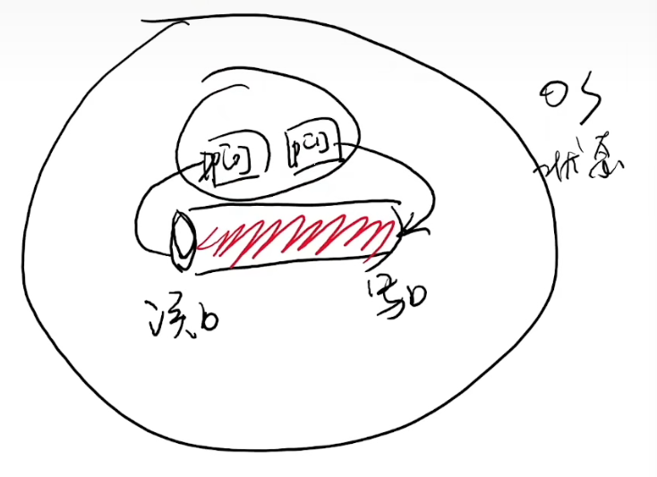

# 系统调用和shell

## shell简介

- shell就是操作系统kernel外包的一层壳

- 与人类直接交互的第一个程序
- 帮助人类创建/管理进程(应用程序)、数据文件...

## Pipe

源代码：[sh-xv6.c](http://jyywiki.cn/pages/OS/2022/demos/sh-xv6.c) 

`syscall(SYS_fork)`返回值为0则说明该线程是子线程

`syscall(SYS_close, 1)`编号为1的文件描述符是stdout，编号为0的文件描述符是stdin。

`syscall(SYS_dup, p[1])`将当前的文件描述符复制一份，找一份当前最小编号的文件描述符作为复制目标。

执行完第一个if后的状态

执行完第二个if后的状态

执行完剩余操作后的状态

## 基于文本替换的快速工作流搭建

- 重定向: `cmd > file < file 2> /dev/null`
- 顺序结构: `cmd1; cmd2`, `cmd1 && cmd2`, `cmd1 || cmd2`
- 管道: `cmd1 | cmd2`
- 预处理: `$()`, `<()`
- 变量/环境变量、控制流……

## Job control

- 类比窗口管理器里的 “叉”、“最小化”
  - jobs(查看所有程序), fg(将后台程序放到前台), bg, wait
  - (今天的 GUI 并没有比 CLI 多做太多事)

## 终端

- UNIX中一类非常特别的设备
- tty,stty,...

## Session,进程组和信号

