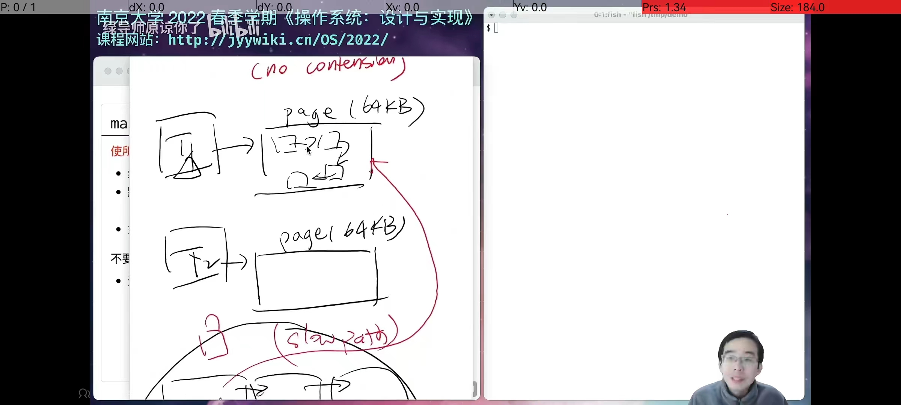

# C标准库的实现

## libc的重要性

- "裸奔"编程：能用且够用，但不好用

## 封装(1)：纯粹的计算

e.g.`memset`

- 多线程不负责数据竞争

## 封装(2)：文件描述符

- FILE * 背后是一个文件描述符
- 可以用gdb查看具体的FILE *(e.g. stdout)

popen和pclose：一个设计有缺陷的API

## 封装(3)：更多的进程/操作系统功能

- warn("%s", fname);(warn在头文件err.h中)
- environ可以用gdb知道实在boot loader的时候赋值的

## 封装(4)：地址空间

## malloc和free

### workload分析

- 越小的对象创建/分配越频繁，并发度越高
- 越大的对象创建/分配越少

### 解决方法

设置两套系统：

- fast path：性能极好，并行度极高，覆盖大部分情况，小概率会失败(fall back to slow path)
- slow path：没那么快，但可以保证完成

fast path

分配:Segregated List(隔离的表，Slab)

- 每个slab里的每个对象都一样大
  - 每个线程拥有每个对象大小的slab
  - fast path：立即在线程本地分配完成
  - slow path：pgalloc()

- 两种实现
  - 全局大链表 or List sharding(per-page 小链表)

回收

- 直接归还到slab中(可能是另一个线程持有的slab，需要per-slab锁)