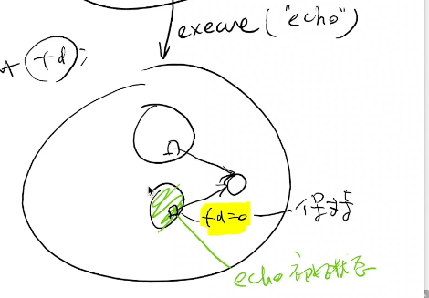

# fork的应用

## 文件描述符的复制

fork之后执行execve时，状态机reset，但文件描述符不变



e.g.

```c
#include <fcntl.h>
#include <unistd.h>

int main() {
    int fd = open("a.txt", O_WRONLY | O_CREAT);
    int pid = fork();
    if(pid == 0) {
        write(fd, "Hello", 5);
    }
    else {
        write(fd, "World", 5);
    }
}
```

## 写时复制(Copy-on-write)

概念上状态机被复制，但实际上复制后内存都被共享

- “Copy-on-write” 只有被写入的页面才会复制一份
  - 被复制后，整个地址空间都被标记为 “只读”
  - 操作系统捕获 Page Fault 后酌情复制页面
  - fork-execve 效率得到提升
- 操作系统会维护每个页面的引用计数