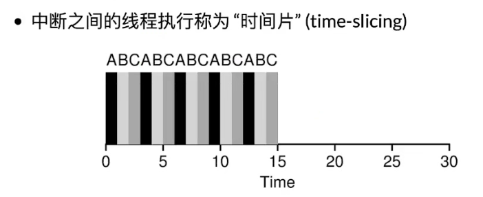

# 处理器的调度

## Round-Robin

一个个轮着来



## 基于优先级的调度策略(RTOS)

- -20~19的整数

- nice值越大越容易让别的进程得到CPU

问题：希望纯计算的后台任务和需要输入的前台任务得到同等优先级

## 动态优先级(MLFQ)

将计算量大的多线程任务的nice值降低，计算量小的适当提升

## Complete Fair Scheduling(CFS)

- 让系统里的所有进程尽可能公平地共享处理器
- 将算力均匀分配
- 每次可以选择运行时间最少的运行

疑问：长时间运行后如果新增一个进程会不会使得长时间运行的卡顿？

### 优先级策略

nice级越高，时钟越快，真实运行时间越短

## 生产者-消费者问题

- 假设有一个生产者，一个消费者，一个while(1)
- 使用RR调度会造成生产者和消费者CPU占用过低
- 使用MLFQ会造成while(1)CPU占用过低
- 使用CFS能基本解决问题

## 优先级反转问题

```c
void xiao_zhang() { // 高优先级
  sleep(1); // 休息一下先
  mutex_lock(&wc);
  ...
}

void xi_zhu_ren() { // 中优先级
  while (1) ;
}

void jyy() { // 最低优先级
  mutex_lock(&wc);
  ...
}
```

校长和jyy共享一个互斥锁，jyy先用wc，校长睡过之后要用发现jyy在用，根据互斥锁的原则要等待；如果jyy因为优先级在等系主任的话相当于校长在等系主任，优先级反转