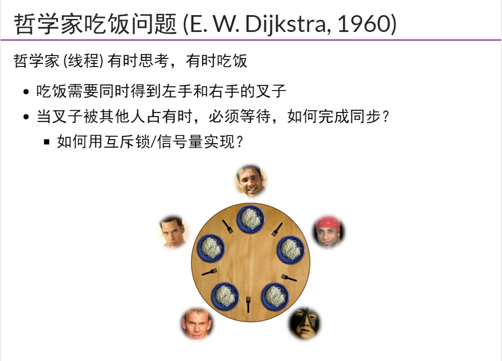

# 并发控制：同步

## 同步

两个或两个以上随时间变化的量在变化过程中保持一定的相对关系

## 生产者-消费者问题

生产者：如果拿到控制权就生产出一个东西到集合中，满了就无法继续生产

消费者：如果拿到控制权就将一个东西从集合中取出，空了就无法继续消费

## 条件变量（Conditional Variables, CV）

- 把自旋变为睡眠
- 在完成操作时唤醒

### API

- wait(cv, mutex)

调用时必须保证已经获得mutex，然后释放mutex，进入睡眠状态

- signal/notify(cv)

如有线程正在等待cv，则唤醒**其中一个**线程

- broadcast/notify_All(cv)

唤醒**全部**正在等待cv的进程

### 条件变量实现生产者-消费者

解决的问题：左括号与右括号匹配，右括号必须在左括号之后出现，叠加的左括号层数不能超过n

```c
void Tproduce() 
{
    mutex_lock(&lk);
    if(count == n) cond_wait(&cv, &lk);//生产满了然后等待,等待之初释放锁，等待结束后再试图获得锁
    printf("("); count++; cond_signal(&cv);//等待结束，满上，然后唤醒
    mutex_unlock(&lk);
}

void Tconsume() 
{
    mutex_lock(&lk);
    if(count == 0) cond_wait(&cv, &lk);//空了就等待
    printf(")"); count--; cond_signal(&cv);//等待结束，消费，然后唤醒
    mutex_unlock(&lk);
}
```

出现的问题：

- 假设产生了一个生产线程和两个消费线程，两个消费线程在等待（因为为空）
- 生产线程发出信号之后激活一个消费线程，打印一个")"
- 消费线程如果激活的是另一个消费线程，则会出现"())"的不合理结果

解决方案：

- 生产者和消费者使用不同的cv变量
- 条件的if改成while，其他线程满足时signal改成broadcast

## 信号量(疑问：S>1时会造成进程间满足条件后同时执行的问题吗)

- 可以有多把钥匙
- 释放时如果等待队列有线程就直接唤醒线程，否则将令牌还给管理员
- 可使用P/V的API （假设信号量为S）
  - S：大于0时为当前可用资源的数量，小于0时其绝对值为等待使用资源的进程个数。
  - P操作：
    - 将S自减1
    - S<0:进入阻塞队列
    - 否则执行该线程
  - V操作：
    - 将S自加1
    - S>0:该进程继续执行
    - S<0:唤醒第一个阻塞进程
- 在P/V间夹临界区操作
- 在"一单位资源"明确的问题上更好用

## 哲学家吃饭问题（死锁）



解决方法：

- 互斥锁

```c
mutex_lock(&mutex);
while(!(avail[lhs] && avail[rhs])) 
{
    wait(&cv, &mutex);
}
avail[lhs] = avail[rhs] = false;//在锁的保护下拿起叉子
mutex_unlock(&mutex);
//吃饭...
mutex_lock(&mutex);
avail[lhs] = avail[rhs] = true;//把叉子还回去
broadcast(&cv);
mutex_unlock(&mutex);
```

- 服务员模型，集中统一管理

```c
void Tphilosopher(int id) 
{
    send_request(id, EAT);
    P(allowed[id]);//服务员把叉子递给哲学家
    philosopher_eat();
    send_request(id, DONE);
}

void Twaiter() 
{
    while(1)
    {
        (id, status) = receive_request();
        if(status == EAT) {...}
        if(status == DONE) {...}
    }
}
```

